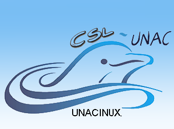

## Comunidad de Software Libre de la Universidad Nacional del Callao "UNACINUX"

 

  

    
  

  

  
la Comunidad de Software Libre de la Universidad Nacional del Callao
  "UNACINUX", es una organización de estudiantes y egresados de las diferentes
  Facultades de la Universidad Nacional del Callao, fundado un 16 de Marzo del
  2006 por Resolución Rectoral N° 260-2006-R, y con Resolución Rectoral
  actualizada N° 1124-09-R, como una iniciativa de estudiantes cuya motivación
  especial era emprender un gran reto enfocado en la prospectiva del Software
  Libre como alternativa a la educación, el estado y la empresa. Asi
  complementar nuestra formación académica, humana y profesional para una mejor
  contribución por sobre todo con nuestra sociedad.  

  
UNACINUX, es el nombre que le damos por ser la UNAC nuestra alma mater y
  por ser nosotros  participes de compartir la misma Filosofía del Software
  Libre. Por ello nuestro lema es:

  <blockquote class="pull-right">"Compartir el conocimiento es generar mas riqueza intelectual"</blockquote>
  

 

## Junta Directiva

  

    <h3>Presidente</h3>
    
    <dl class="dl-horizontal">
      <dt>Presidente</dt>
        <dd>Arnold Fernández Rivas<dd>
      <dt>Facultad</dt>
        <dd>FIARN</dd>
    </dl>
  

  

    <h3>Vice Presidente</h3>
    <dl class="dl-horizontal">
      <dt>Vice presidente</dt>
        <dd>Fernando Mayhua Vilca<dd>
      <dt>Facultad</dt>
        <dd>FIARN</dd>
    </dl>
  

