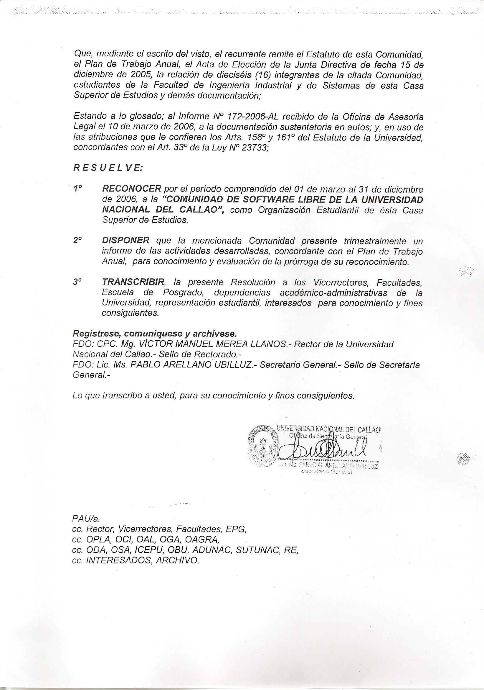

## Resolución Rectoral de Fundación de la CSL-UNAC

Mediante la presente Resolución Rectoral, la Universidad Nacional del Callao,
reconoce a la Comunidad de Software Libre "UNACINUX", como una Organización
Estudiantil que tiene como objetivo promover e impulsar el Software Libre
dentro y fuera de la UNAC.

